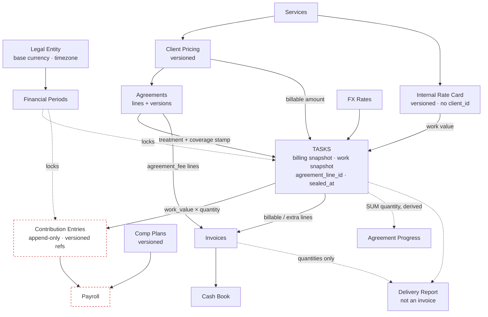

> **SUPERSEDED IN PART (5 Aug 2026):** `lib/tasks/pricing.ts` (the unified task
> billing engine, commit 68c1f4c) now owns client-side billing: matrix pricing and
> retainer coverage (`effectiveBillingAmount`). The spec fields `work_value`,
> `billing_treatment` and `agreement_lines` were never built. The only live
> remainder is the employee-pay question (old step 3.4) — re-scope before
> implementing anything below. Step 3.0 (guarded contribution writes) shipped
> separately on 5 Aug 2026.

# Cirqle Financial Core — Implementation Specification

**Status:** Frozen · **Date:** 2 August 2026 · **Supersedes:** `financial-core.md`, `simplify-agreements.md`
**Audience:** implementing engineer / agent. This is a build document, not a discussion.

---

## 0. Naming collisions found in the live schema — read first

Two names in the agreed architecture already exist in the database with **different meanings**. Using them as specified would silently corrupt existing behaviour.

| Agreed name | Already exists as | Resolution |
|---|---|---|
| `billing_mode` (covered/extra/billable…) | `tasks.billing_mode` = `fixed` \| `percent_of_parent` — how a **sub-task's amount is computed** from its parent. 1,000 rows in use. | New column is **`billing_treatment`**. The existing column is renamed `amount_basis` in Phase 3.6. |
| `retainer_item_id` | exists, points at `client_agreement_items.id` — a **term row** that close-and-replace destroys | Replaced by **`agreement_line_id`** pointing at a new stable `agreement_lines` table (§2.4) |

Nothing else in the agreed vocabulary collides. `bill_as_extra`, `billing_snapshot`, `billing_override`, `is_billable` all exist and keep their meaning.

---

## 1. Architecture Decision Record

Each decision is **final**. Consequences are what the implementer must accept.

### ADR-01 — Dependencies form a DAG; no module recomputes another's numbers
Modules are not independent — invoices must read tasks. They are **acyclic**. A module may read another's output; it may never re-derive it.
**Consequence:** Reports read stored contribution amounts. They never recompute earnings. The four disagreeing margin engines found in the audit are forbidden by construction.

### ADR-02 — Financial values freeze at a Seal event
A task is operationally mutable and financially immutable. `sealed_at` is set by whichever comes first: invoiced, containing period closed, or manual seal. Before seal, financial fields re-derive on edit. After seal they are immutable; corrections are adjusting entries.
**Consequence:** "Frozen at creation" is wrong and is not implemented. Editing an unsealed task legitimately changes its numbers.

### ADR-03 — Period locking is the enforcement mechanism for history
`financial_periods(entity, period, status)`. `closed` blocks writes to sealed records in that period.
**Consequence:** Principle "history never changes" is enforceable only after §2.2 ships. Until then it is aspirational.

### ADR-04 — Billing is resolved in two ordered steps
Treatment first, amount second. Treatment is never overridable by a price field.
**Consequence:** A manual override cannot make a covered task billable. Only `bill_as_extra` can. This is the guard that prevents the #1883 double-bill.

### ADR-05 — Work value comes from an Internal Rate Card, never from client pricing
Effective-dated, service-scoped, entity-scoped. **No `client_id` column, ever.**
**Consequence:** Identical work pays identically regardless of what the client negotiated. A per-task override with reason + actor is the only escape valve.

### ADR-06 — Contributions are an append-only ledger carrying version references
Each row stores the computed amount plus `rate_card_version_id`, `parameter_version_id`, `comp_plan_version_id`. Corrections are reversing rows.
**Consequence:** Changing a parameter weight next quarter cannot alter last quarter's payroll. Recalculation is an explicit audited operation, never a side effect of rendering.

### ADR-07 — Agreement progress is derived, never stored
`delivered = SUM(quantity)` of completed, non-deleted tasks where `agreement_line_id` matches and `bill_as_extra` is false. `extra_billed` is the same sum where `bill_as_extra` is true, and does **not** consume the allowance.
**Consequence:** No counters. Correctness now depends entirely on stamping, so §5.10 (reconciliation screen) is mandatory, not optional.

### ADR-08 — Agreement lines have stable identity separate from their terms
`agreement_lines` (stable, the lineage anchor) + `agreement_line_versions` (effective-dated terms). Tasks stamp the **line**, never the version.
**Consequence:** Renegotiation no longer zeroes progress or breaks invoice→delivery resolution. This is the single highest-value structural fix in the spec.

### ADR-09 — One invoice engine; the delivery detail is not an invoice
Agreement fees and task charges are both ordinary invoice lines, discriminated by `source_type`. The Delivery Report shows **quantities only, never amounts**, carries no invoice number, and is generated live and date-stamped.
**Consequence:** Nothing ever renders a parent line whose children don't sum to it.

### ADR-10 — Buffer is derived; only the target is stored
`buffer = agreed_fee − Σ(committed line values)`. Store `contingency_target_pct` only.
**Consequence:** Adding a commitment without raising the fee shrinks the buffer visibly. Buffer is structurally absent from contributions because it never enters any task's work value.

### ADR-11 — Revenue is not a separate ledger yet
While recognition and invoicing coincide, invoices **are** the revenue ledger. `revenue_events` is deferred until the first divergence (annual prepay, deferred revenue, milestone recognition).
**Consequence:** Do not build it in Phase 3. Revision of earlier advice; documented so nobody re-adds it speculatively.

### ADR-12 — Task financial fields stay on `tasks`
Not split into `task_financials`. At ~1,900 rows a 1:1 join costs more than it saves.
**Consequence:** `tasks` grows to ~48 columns. Documented split trigger: **>1M task rows, or when period-partitioning is needed.** Revisit then, not before.

### ADR-13 — Quotations is replaced by the draft-agreement lifecycle
`draft → proposal_sent → accepted → active`, plus `lost` and `cancelled`.
**Consequence:** Requires `lost_reason` and separate numbering, or win/loss reporting becomes impossible.

### ADR-14 — Every money mutation is a server action with an idempotency key
No browser writes to financial tables.
**Consequence:** **This is a hard prerequisite for Phase 3.** Contributions are still browser-written today; the cost model cannot sit on a mutable substrate.

---

## 2. Database Model

Postgres / Supabase. All new tables get RLS + `REVOKE ALL FROM anon` per the established pattern.

### 2.1 Legal entities — add now, one row today

```sql
CREATE TABLE legal_entities (
  id              uuid PRIMARY KEY DEFAULT gen_random_uuid(),
  code            text NOT NULL UNIQUE,          -- 'CIRQLE_IN'
  name            text NOT NULL,
  base_currency   text NOT NULL,                  -- reporting currency for this entity
  timezone        text NOT NULL,                  -- IANA, e.g. 'Asia/Kolkata' — decides "today"
  is_active       boolean NOT NULL DEFAULT true,
  created_at      timestamptz NOT NULL DEFAULT now()
);
```

`legal_entity_id uuid REFERENCES legal_entities(id)` is added to: `tasks`, `invoices`, `payments`, `cashbook_entries`, `agreements`, `contributions`, `payroll`, `clients`, `employees`. **Nullable at first, backfilled to the single entity, then set NOT NULL.** Retrofitting later means rewriting every query.

### 2.2 Financial periods

```sql
CREATE TABLE financial_periods (
  id           uuid PRIMARY KEY DEFAULT gen_random_uuid(),
  entity_id    uuid NOT NULL REFERENCES legal_entities(id),
  period       text NOT NULL,                     -- 'YYYY-MM'
  status       text NOT NULL DEFAULT 'open'
               CHECK (status IN ('open','closed')),
  closed_at    timestamptz,
  closed_by    uuid REFERENCES employees(id),
  UNIQUE (entity_id, period)
);
```

A missing row means open. Closing is an explicit admin action.

### 2.3 FX — one table, one function, snapshot everywhere

`exchange_rates` exists. Extend it rather than replacing:

```sql
ALTER TABLE exchange_rates
  ADD COLUMN IF NOT EXISTS valid_from date NOT NULL DEFAULT CURRENT_DATE,
  ADD COLUMN IF NOT EXISTS valid_to   date,
  ADD COLUMN IF NOT EXISTS source     text;       -- 'manual' | 'api:<provider>'

CREATE OR REPLACE FUNCTION fx_rate_on(p_currency text, p_base text, p_on date)
RETURNS numeric LANGUAGE sql STABLE AS $$ ... $$;
```

**Rule:** every converted amount stores `*_base`, `*_fx_rate` and `*_fx_date`. Historical rows are never re-converted.

### 2.4 Agreements — lineage split

```sql
-- STABLE identity. Never updated when terms change. Tasks stamp THIS.
CREATE TABLE agreement_lines (
  id             uuid PRIMARY KEY DEFAULT gen_random_uuid(),
  agreement_id   uuid NOT NULL REFERENCES client_agreements(id) ON DELETE CASCADE,
  line_type      text NOT NULL CHECK (line_type IN ('unit','flat')),
  display_order  int  NOT NULL DEFAULT 0,
  created_at     timestamptz NOT NULL DEFAULT now()
);

-- Effective-dated terms. Close-and-replace inserts a new version here.
CREATE TABLE agreement_line_versions (
  id                  uuid PRIMARY KEY DEFAULT gen_random_uuid(),
  line_id             uuid NOT NULL REFERENCES agreement_lines(id) ON DELETE CASCADE,
  service_id          uuid REFERENCES services(id),
  commitment_type     text NOT NULL,               -- 'retainer' | 'one_time'
  committed_quantity  numeric,
  cycle               text,                        -- 'monthly' (only implemented value)
  agreed_unit_price   numeric,                     -- snapshot at signing
  list_unit_price     numeric,                     -- what the matrix said, for variance
  currency            text NOT NULL,
  effective_from      date NOT NULL,
  effective_to        date,
  created_at          timestamptz NOT NULL DEFAULT now(),
  CHECK (effective_to IS NULL OR effective_to >= effective_from)
);
CREATE INDEX ON agreement_line_versions (line_id, effective_from DESC);
```

Covered-services mapping moves from `agreement_item_services.agreement_item_id` to `line_id`.

Agreement header gains:

```sql
ALTER TABLE client_agreements
  ADD COLUMN agreed_fee              numeric,
  ADD COLUMN fee_currency            text,
  ADD COLUMN contingency_target_pct  numeric,      -- intent only; buffer is derived
  ADD COLUMN proration_policy        text NOT NULL DEFAULT 'prorate'
      CHECK (proration_policy IN ('prorate','full_month')),
  ADD COLUMN billing_timing          text NOT NULL DEFAULT 'advance'
      CHECK (billing_timing IN ('advance','arrears')),
  ADD COLUMN lost_reason             text;
```

Status enum becomes: `draft | proposal_sent | accepted | active | paused | completed | cancelled | lost | expired`.

### 2.5 Internal rate card

```sql
CREATE TABLE service_work_values (
  id           uuid PRIMARY KEY DEFAULT gen_random_uuid(),
  entity_id    uuid NOT NULL REFERENCES legal_entities(id),
  service_id   uuid NOT NULL REFERENCES services(id),
  unit_value   numeric NOT NULL CHECK (unit_value >= 0),
  currency     text NOT NULL,
  valid_from   date NOT NULL,
  valid_to     date,
  note         text,
  created_by   uuid REFERENCES employees(id),
  created_at   timestamptz NOT NULL DEFAULT now(),
  CHECK (valid_to IS NULL OR valid_to >= valid_from)
);
CREATE UNIQUE INDEX ON service_work_values (entity_id, service_id, valid_from);
```

**No `client_id`. Adding one is a spec violation.**

### 2.6 Client pricing — versioned

```sql
ALTER TABLE client_service_pricing
  ADD COLUMN valid_from date NOT NULL DEFAULT CURRENT_DATE,
  ADD COLUMN valid_to   date;
CREATE INDEX ON client_service_pricing (client_id, service_id, valid_from DESC);
```

Edits close the current row and insert a successor. No in-place price updates.

### 2.7 Tasks — new columns

```sql
ALTER TABLE tasks
  -- lineage (replaces retainer_item_id)
  ADD COLUMN agreement_line_id uuid REFERENCES agreement_lines(id),

  -- treatment: authoritative. NOT the existing billing_mode.
  ADD COLUMN billing_treatment text NOT NULL DEFAULT 'billable'
      CHECK (billing_treatment IN
        ('billable','covered','extra','free','internal','write_off')),

  -- work value snapshot (drives contributions)
  ADD COLUMN work_unit_value      numeric,
  ADD COLUMN work_value_currency  text,
  ADD COLUMN work_unit_value_base numeric,
  ADD COLUMN work_value_fx_rate   numeric,
  ADD COLUMN work_value_fx_date   date,
  ADD COLUMN work_value_source    text
      CHECK (work_value_source IN ('override','rate_card','none')),
  ADD COLUMN work_value_version_id uuid REFERENCES service_work_values(id),
  ADD COLUMN work_value_note      text,            -- required when source='override'

  -- billing snapshot (drives invoicing)
  ADD COLUMN billable_unit_base   numeric,
  ADD COLUMN billing_fx_date      date,
  ADD COLUMN billing_source       text
      CHECK (billing_source IN
        ('override','agreement_extra','client_pricing','service_default','covered','none')),

  -- seal
  ADD COLUMN sealed_at   timestamptz,
  ADD COLUMN sealed_by   uuid REFERENCES employees(id),
  ADD COLUMN seal_reason text CHECK (seal_reason IN ('invoiced','period_closed','manual'));

CREATE INDEX ON tasks (agreement_line_id) WHERE deleted_at IS NULL;
CREATE INDEX ON tasks (legal_entity_id, task_date) WHERE deleted_at IS NULL;
```

Existing `billing_amount` / `billing_amount_inr` / `billing_exchange_rate` are retained as the native/base/rate triple. **Do not rename `billing_amount_inr` in Phase 3** — too many call sites; scheduled for Phase 5 as `billing_amount_base`.

### 2.8 Contributions — append-only

```sql
CREATE TABLE contribution_entries (
  id                   uuid PRIMARY KEY DEFAULT gen_random_uuid(),
  entity_id            uuid NOT NULL REFERENCES legal_entities(id),
  task_id              uuid NOT NULL REFERENCES tasks(id),
  employee_id          uuid NOT NULL REFERENCES employees(id),
  period               text NOT NULL,               -- from task_date, entity tz
  parameter_id         uuid REFERENCES parameters(id),
  weight               numeric NOT NULL,
  amount_native        numeric NOT NULL,
  currency             text NOT NULL,
  amount_base          numeric NOT NULL,
  fx_rate              numeric NOT NULL,
  fx_date              date NOT NULL,
  rate_card_version_id uuid REFERENCES service_work_values(id),
  parameter_version_id uuid,                        -- see 2.9
  reversal_of_id       uuid REFERENCES contribution_entries(id),
  created_at           timestamptz NOT NULL DEFAULT now(),
  created_by           uuid REFERENCES employees(id)
);
CREATE INDEX ON contribution_entries (employee_id, period);
CREATE INDEX ON contribution_entries (task_id);
```

**Never UPDATE, never DELETE.** A correction inserts a negative row with `reversal_of_id`.

### 2.9 Parameter versioning

```sql
CREATE TABLE parameter_versions (
  id          uuid PRIMARY KEY DEFAULT gen_random_uuid(),
  group_id    uuid NOT NULL REFERENCES contribution_groups(id),
  snapshot    jsonb NOT NULL,        -- [{parameter_id, name, weight, is_master}]
  valid_from  date NOT NULL,
  valid_to    date,
  created_by  uuid REFERENCES employees(id)
);
```

Editing any weight in a group closes the current version and inserts a successor. Contributions reference the version in force at the task's `task_date`.

### 2.10 Compensation plans

```sql
CREATE TABLE compensation_plans (
  id          uuid PRIMARY KEY DEFAULT gen_random_uuid(),
  employee_id uuid NOT NULL REFERENCES employees(id),
  plan_type   text NOT NULL CHECK (plan_type IN ('commission_pct','fixed','per_unit','hybrid')),
  params      jsonb NOT NULL,
  valid_from  date NOT NULL,
  valid_to    date
);
```

### 2.11 Invoices

```sql
ALTER TABLE invoice_items
  ADD COLUMN source_type text NOT NULL DEFAULT 'task'
      CHECK (source_type IN ('task','agreement_fee','manual')),
  ADD COLUMN agreement_line_id uuid REFERENCES agreement_lines(id),
  ADD COLUMN period text;                            -- 'YYYY-MM' for fee lines

ALTER TABLE invoices
  ADD COLUMN issued_at timestamptz,                  -- null = still draft/mutable
  ADD COLUMN legal_entity_id uuid REFERENCES legal_entities(id);
```

An invoice with `issued_at` set is immutable. Corrections are credit notes.

### 2.12 Numbering and idempotency

```sql
CREATE TABLE document_sequences (
  entity_id  uuid NOT NULL REFERENCES legal_entities(id),
  doc_type   text NOT NULL,        -- 'invoice'|'agreement'|'proposal'|'receipt'|'credit_note'
  year       int  NOT NULL,
  next_value int  NOT NULL DEFAULT 1,
  PRIMARY KEY (entity_id, doc_type, year)
);
-- Allocation uses SELECT ... FOR UPDATE inside the same transaction as the insert.

CREATE TABLE idempotency_keys (
  key         text PRIMARY KEY,
  operation   text NOT NULL,
  result      jsonb,
  created_at  timestamptz NOT NULL DEFAULT now()
);
```

Every money-mutating server action takes a client-generated key. Replay returns the stored result instead of writing again.

---

## 3. Module Responsibilities

| Module | Owns | Reads | **Must never read** |
|---|---|---|---|
| **Legal entities** | entity, base currency, timezone | — | — |
| **Periods** | open/closed state | entities | — |
| **FX** | rates, `fx_rate_on()` | — | — |
| **Services** | catalog | — | — |
| **Client pricing** | list price per client (versioned) | services | agreements, tasks |
| **Internal rate card** | work values (versioned) | services, entities | **client pricing, agreements, invoices** |
| **Agreements** | commitments, agreed fee, lifecycle | client pricing (defaults only) | tasks' money, work_value |
| **Tasks** | work events, both snapshots, line stamp, seal | pricing, rate card, agreements, FX | invoices, payroll |
| **Contributions** | earnings ledger (append-only) | tasks, parameter versions | **invoices, agreements, client pricing** |
| **Payroll** | period compensation | contributions, comp plans | **invoices, client pricing, tasks' billing** |
| **Invoices** | client billing | tasks (billable/extra), agreements (fee) | **work_value, contributions** |
| **Cash Book** | money movement | invoices | work_value |
| **Audit** | append-only actor/before/after | — | — |

Progress is **not owned** by Agreements. It is a query over Tasks.

---

## 4. Data Flow



The two dotted paths into Contributions/Payroll are the ones that must **never** reverse: no arrow may ever run from Invoices back to Contributions.

---

## 5. Implementation Roadmap

Each phase is independently shippable and independently revertible.

### Phase 3.0 — Prerequisite (blocks everything)
Move all contribution writes to server actions with permission guards and idempotency keys. Remove browser Supabase writes from `contributions-client.tsx` and `bulk-generate-modal.tsx`.
**Gate:** zero `supabase.from('contribution` writes in any `.tsx`.

### Phase 3.1 — Foundation
`legal_entities` (seed one row), `financial_periods`, FX effective dating + `fx_rate_on()`. Add nullable `legal_entity_id` everywhere, backfill, set NOT NULL.
**Gate:** every transactional table has a non-null entity.

### Phase 3.2 — Internal rate card
Create `service_work_values`, seed from current service default prices so day-one behaviour is unchanged. Admin UI under Settings → Catalog.
**Gate:** every active service has a value valid today; a report lists those that don't.

### Phase 3.3 — Task work-value snapshot
Add the `work_*` columns. Populate on create/edit for unsealed tasks: override → rate card at `task_date` → `source='none'`.
Backfill historical tasks. **Publish the count landing on `none` before proceeding.**
**Gate:** ≤2% of completed tasks unvalued, each visible in a queue.

### Phase 3.4 — Contributions read work value
Create `contribution_entries` + `parameter_versions`. Compute from `work_unit_value × quantity`, split by parameter weights. Run the old path in parallel behind a flag for one payroll cycle and diff.
**Gate:** diff explains every variance; covered retainer tasks move from 0 to their work value.

### Phase 3.5 — Agreement lineage
Create `agreement_lines` / `agreement_line_versions`. Migrate `client_agreement_items` → one line + one version each. Add `tasks.agreement_line_id`, backfill from `retainer_item_id`. Re-stamp on activate/cancel/terms-change.
**Gate:** renegotiating a line preserves its delivered count.

### Phase 3.6 — Billing treatment
Add `billing_treatment`, backfill (`retainer_item_id` present + amount 0 → `covered`; + `bill_as_extra` → `extra`; else `billable`). Rename existing `billing_mode` → `amount_basis`. Implement the two-step resolver.
**Gate:** no code path infers coverage from `amount = 0`.

### Phase 3.7 — Sealing and period locking
`sealed_at` on invoice / period close / manual. Block financial edits to sealed tasks and any write into a closed period.
**Gate:** editing a sealed task's amount is refused with a clear message.

### Phase 3.8 — Invoicing and Delivery Report
`source_type` on invoice items; agreement fee lines; `issued_at` immutability + credit notes. Delivery Report: quantities only, no invoice number, generated live and date-stamped, PDF archived on send.
**Gate:** a retainer invoice shows fee lines; its Delivery Report shows quantities and no money.

### Phase 3.9 — Agreements as proposal
Extend the status enum, add `lost_reason`, separate proposal numbering. Drop the Quotations nav item, module and tables (0 rows).
**Gate:** a draft agreement can be sent, accepted and activated without touching Quotations.

### Phase 3.10 — Reconciliation screen
Three lists: unstamped tasks matching an agreement's service+period; tasks stamped to a closed/expired line; tasks whose client ≠ the agreement's client.
**Gate:** ships with 3.5, not after.

---

## 6. Migration Plan

Additive and reversible until 3.4. Every migration gets a rollback in `supabase/rollbacks/`.

| # | Migration | Reversible | Risk |
|---|---|---|---|
| 1 | `legal_entities`, `financial_periods`, FX dating | yes | none |
| 2 | `legal_entity_id` nullable + backfill + NOT NULL | yes until NOT NULL | low |
| 3 | `service_work_values` + seed | yes | none — nothing reads it |
| 4 | task `work_*` columns + backfill | yes | none — nothing reads them |
| 5 | `contribution_entries`, `parameter_versions` | yes | none until 3.4 cutover |
| 6 | **cut contributions over** | flag-reversible | **highest — earnings change** |
| 7 | `agreement_lines` + versions + backfill + `agreement_line_id` | yes | medium |
| 8 | `billing_treatment` + backfill; rename `billing_mode`→`amount_basis` | yes | medium — 1,000 rows use the old column |
| 9 | seal + period lock | yes | medium — starts refusing writes |
| 10 | invoice `source_type`, `issued_at` | yes | low |
| 11 | drop Quotations | yes (0 rows) | none |

**Step 6 is the one that changes numbers.** Retainer-covered tasks go from paying 0 to paying their work value. Reconcile a full month in parallel and tell the team before it lands.

**Do not run steps 7 and 8 in the same deploy.** Both touch task rows at scale; separate them so a rollback is unambiguous.

---

## 7. Risks

| Risk | Impact | Mitigation |
|---|---|---|
| Browser writes still bypass everything | Whole model advisory | Phase 3.0 is a hard gate |
| Parameter system has zero tests | Silent payroll error | Test suite lands with 3.4 |
| Stamping is now load-bearing | Silent underdelivery | Reconciliation screen ships with 3.5 |
| `billing_mode` rename touches 1,000 rows | Sub-task billing breaks | Separate deploy; regression-test parent/child tasks |
| Rate card gaps block sealing | Work can't be finalised | Publish the `source='none'` count before 3.4 |
| Contribution cutover changes pay | Trust damage | Parallel run + reconciliation + advance notice |
| Timezone ambiguity | Work lands in wrong period | Decide before 3.1 (§8) |

---

## 8. Decide NOW — blocks Phase 3.1

Six answers required. Everything else is specified.

1. **Base currency per entity** — INR or AED? Determines every `*_base` value.
2. **Timezone** — `Asia/Kolkata`? Decides which period a task falls in.
3. **Proration** — does billing prorate a partial first month to match the commitment, or charge the full fee? (Elara: AED 400 or ~155 for July.) Billing and commitment must agree.
4. **Billing timing** — advance is the default per Elara's terms; confirm it applies to all retainers.
5. **Work value for existing tasks with no rate-card entry** — block sealing, or seal at 0 with a flag?
6. **Retrospective contributions** — when 3.4 lands, do previously-covered tasks get back-paid, or does the new model apply from a cutover date only? *(Recommendation: cutover date only. Back-paying rewrites closed payroll, which ADR-02 forbids.)*

---

## 9. Explicitly out of scope

`revenue_events` (ADR-11) · `task_financials` split (ADR-12) · per-designation RLS read policies · tax engine · multi-entity consolidation · partitioning. Each has a documented trigger condition; none is needed for Phase 3.
